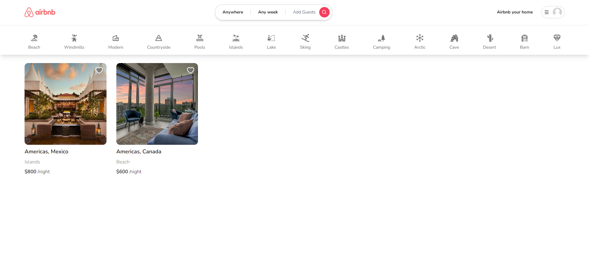
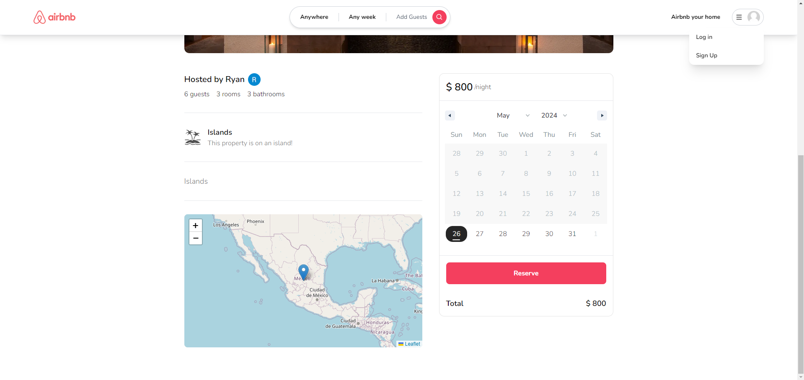

# Full-Stack Airbnb Clone with Next.js 14!

Full Stack Airbnb Clone with Next.js 14 Tailwind-css, Prisma, MongoDB, NextAuth,  Login (Google and Github), Image upload, Cloudinary CDN, Location selection, Map component, Country autocomplete, Fetching listings with server components.

## Examples
Homepage:

Reservation booking:

